<div align="center">

[Русский](README.md) · **English**

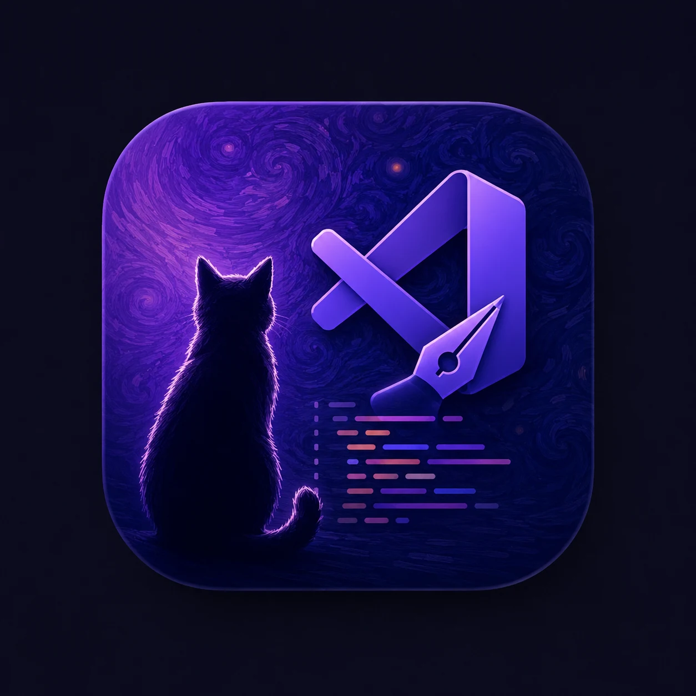

# MoonLight custom-bg

### A living background and a full theming panel for VS Code — right inside the editor

Per-zone images · sets with their own palette · generative backgrounds with no assets · slideshow<br>
Ken Burns, frosted glass, Aurora, spotlight · background per project · status-bar widgets · RU / EN interface

[](https://github.com/moonlivedt-oss/custom_VScode/actions/workflows/ci.yml)


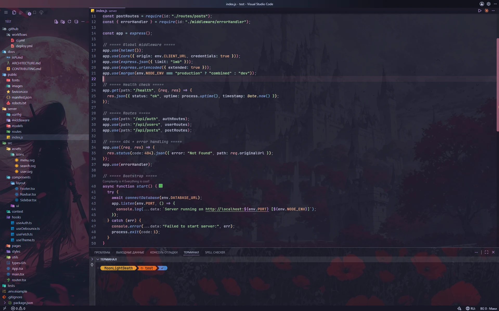

<sub>One self-contained script · zero npm dependencies · set up in a couple of clicks, no file editing</sub>

</div>

---

## Quick start

1. Install a **loader** — the extension that injects the script into the editor window. Either one
   works:
   - **Custom UI Style** (recommended) — `code --install-extension subframe7536.custom-ui-style`.
     It backs up the editor's original files and restores them before every patch, so it
     **survives VS Code updates**, suppresses the "installation appears corrupt" warning and can
     make the window truly transparent.
   - **Custom CSS and JS** — `code --install-extension be5invis.vscode-custom-css`. The classic
     path; its injection is lost after every editor update and has to be re-enabled.
2. Clone the repo: `git clone https://github.com/moonlivedt-oss/custom_VScode.git`
3. Register the path to `custom-bg.js` — easiest with `npm run setup` (it detects which loader is
   installed and writes the import in the right format, backing up your settings first).
   Manually, `Ctrl+Shift+P` → *Open User Settings (JSON)*:
   ```jsonc
   // Custom UI Style
   "custom-ui-style.external.imports": [
     { "type": "js", "url": "file:///d:/path/to/vscode-bg/custom-bg.js" }
   ]
   // or Custom CSS and JS
   "vscode_custom_css.imports": [
     "file:///d:/path/to/vscode-bg/custom-bg.js"
   ]
   ```
4. Apply it: for Custom UI Style run `Ctrl+Shift+P` → **Custom UI Style: Reload**; for Custom CSS
   run `Ctrl+Shift+P` → **Enable Custom CSS and JS**. Then **fully restart** VS Code
   (`File → Exit`).

Done — a **`BG 0`** button appears at the right of the status bar; click it to open the
**Background & design** panel. The active loader is shown in **System → Loader**.

> The interface is bilingual: it auto-detects your VS Code display language, or set it manually in
> **System → Panel language** (Auto / Русский / English).
>
> **True window transparency** (Mica / vibrancy) needs Custom UI Style plus Electron options. The
> ready-made settings are copied by **System → Loader → Copy transparency options**; then enable
> the **True transparency** effect on the View tab.

## What is it

Regular VS Code themes only change colors. "Image on background" plugins put a single static image
behind the whole editor — and that is all.

**MoonLight custom-bg** goes further: one self-contained script, loaded into the VS Code UI through
[`be5invis.vscode-custom-css`](https://marketplace.visualstudio.com/items?itemName=be5invis.vscode-custom-css),
that adds a full theming panel right inside the editor.

| | Regular theme | "Image on background" plugin | MoonLight custom-bg |
|---|---|---|---|
| Custom image | no | yes (one for everything) | **yes, separately for editor / sidebar / panel** |
| Sets with a palette | no | no | **yes, 20 photo sets, each with its own accent** |
| Assetless sets | no | no | **yes, 6 gradient + 7 procedural sets (zero assets)** |
| UI palette from the image | no | no | **yes, the "living border" is painted with the image colors** |
| Background per open project | no | no | **yes, a set is pinned to a folder (and to forks: Cursor / VSCodium / Windsurf)** |
| Timed slideshow | no | no | **yes, with preloading (no flashing)** |
| Setup without editing files | partly | no | **yes, a panel inside the editor + settings search** |
| Undo changes | no | no | **yes, look Undo/Redo (`Ctrl+Alt+Z` / `Ctrl+Alt+Y`)** |
| Effects (Ken Burns, glass, acrylic, living background, UI animations, cursor trail, tint) | no | no | **yes, ~50 of them** |
| Code readability over an image | — | no | **yes: adaptive scrim driven by a luminance map + a contrast meter with one-click fix** |
| True window transparency | no | no | **yes, through Custom UI Style (Mica / vibrancy)** |
| Status-bar widgets | no | no | **yes: clock, pomodoro timer, particles (incl. seasonal)** |
| Interface language | — | — | **RU / EN (auto by VS Code, or manual)** |
| Profiles / power saving | no | no | **yes: 5 one-click profiles + FPS auto-budget** |
| Installation | manual | manual | **`npm run setup` — writes the path automatically** |
| External dependencies | — | — | **none (0 npm packages)** |

---

## Features

Everything is configured in the **Background & design** panel (the `BG N` button in the status bar):

> **New in v20:**
> - **Adaptive scrim** — the background is dimmed exactly where it is brighter than comfortable
>   (an 8×8 luminance map), instead of dimming the whole image with one slider: a bright window
>   behind your code stops interfering while the rest of the picture stays visible.
> - **Readability meter** — the contrast of code against the real backdrop as a number, with a
>   “Fix” button that picks an opacity meeting WCAG AA.
> - **OKLab palette** — the accent is extracted in a perceptual space (like pywal / Material You)
>   instead of HSL, so colors stopped being either acid or invisible.
> - **Instant first frame** — image metrics and thumbnails are cached: no empty background and no
>   accent jump on startup.
> - **Jank-free sliders** — numbers moved into CSS variables, so dragging no longer rebuilds the
>   stylesheet.
> - **Two loaders** — works through `be5invis.vscode-custom-css` and through
>   `subframe7536.custom-ui-style`; the latter survives VS Code updates and unlocks **true window
>   transparency** (Mica / vibrancy), not just in-window glass.
> - **Selector health** in diagnostics — see which workbench elements stopped matching after an
>   editor update.
> - **WebGL shader sets** and **8 new photo sets** built from a single master frame (three times
>   fewer files, zones share one palette).
> - **Quick switcher** `Ctrl+Alt+P` with live preview, and **cross-window sync**.

- **Background sets** — 12 photo sets (images for editor / sidebar / panel), 8 **master-frame**
  sets (one 21:9 frame per set, zones are crops of it), 4 **shader** sets (the frame is computed
  on the GPU), 6 **generative** gradient sets and 7 **procedural** ones (starfield, dunes, grain, grid, topography, matrix, cells — the
  texture is drawn on a canvas, without a single asset). Generative and procedural sets load
  instantly and work on any machine; each zone gets its own gradient shape. Pick a set or "random".
  Every set has **its own accent color** that repaints the UI to match. Rename a set right in the
  panel; hovering a set chip **previews** it without a click.
- **Panel search** — type part of a name and jump to any section or effect on any tab.
- **Undo / redo** — step-by-step look Undo/Redo within a session (buttons in Data, or
  `Ctrl+Alt+Z` / `Ctrl+Alt+Y`). Slideshow and time-of-day auto-switches are not recorded.
- **Install diagnostics** — System → Check installation: a report (version, theme, set, image folder
  and loading, whether custom-css is active) copied to the clipboard — handy to attach to an issue.
- **Background per project** — a set is pinned to the open folder (by the window-title name): your
  work repo opens with a calm set, a pet project with its own. Takes priority over the slideshow and
  time-of-day. Works in VS Code forks (Cursor / VSCodium / Windsurf / Code - OSS) too.
- **Palette from image** — a harmonious palette is extracted from the editor background and the
  "living border" is recolored with it. Plus an **"Accent from image"** button.
- **Parallax** — the editor background shifts ever so slightly with the cursor for depth. Respects
  the system "reduce motion".
- **Flow** — the longer you type without pauses, the more the editor background dims; it returns on
  a reading pause.
- **Presets** — save the whole current look under a name and switch between looks in one click.
- **Share a look** — a short code of the whole look (no images or paths): copy yours or apply someone's.
- **Slideshow** — auto-cycle sets on an interval (1–120 min) with preloading.
- **Time-of-day auto-set** — one set by day, another by night; day bounds are configurable (0–23,
  wrap past midnight supported).
- **Git branch indicator** — a thin strip at the top edge: reddish on `main`/`master`, greenish on
  feature branches (branch read from the status bar).
- **Light and dark theme** — glass, title-bar and scrim surfaces take the active theme's real colors
  (`--vscode-*`); the panel itself adapts too.
- **Master switch** — one toggle (or `Ctrl+Alt+0`) removes all background and effects for plain VS
  Code, keeping your settings.
- **Hotkeys** — `Ctrl+Alt+B` opens the panel, `Ctrl+Alt+.` / `Ctrl+Alt+,` cycle sets,
  `Ctrl+Alt+0` on/off, `Ctrl+Alt+R` reading mode, `Ctrl+Alt+Z` / `Ctrl+Alt+Y` undo/redo.
- **Per-zone brightness** + **editor auto-brightness** (dims light art automatically).
- **Image** — accent color (per set), per-zone image filters (cover / contain, brightness /
  saturation / blur) and a **custom image path** per zone.
- **Effects** — Ken Burns, frosted glass, vignette, cursor glow, living border and more, including
  **accent tint**, **code legibility**, **error reaction**, **Present mode**, **Contrast+** and a
  **focus session** tied to the pomodoro. ~50 toggles, each with a "?" hint.
- **Terminal** — font (width-compatible Nerd fonts), ligatures, glow, cursor size/height/color,
  selection color.

---

## Background sets

The plugin ships 37 sets: 12 photo, 8 master-frame, 6 gradient, 7 procedural and 4 shader ones.
Each has its own accent that repaints the interface.

### How a master frame is cut

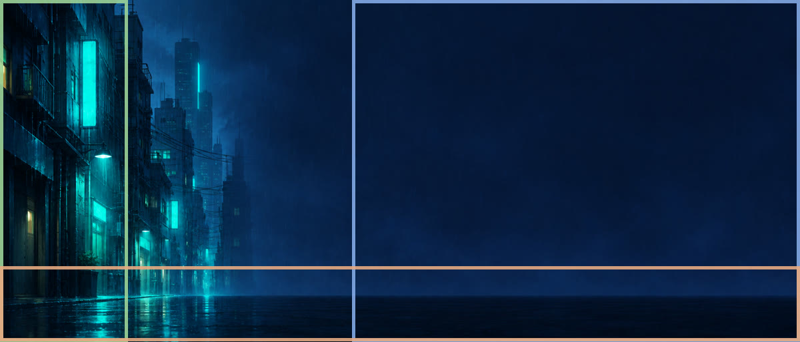

<sub>One file instead of three: <b>green</b> is the sidebar crop (leftmost 16% of the frame),
<b>blue</b> is the editor (the right 56%, the calmest part), <b>orange</b> is the panel (bottom
22%). The composition keeps the subject on the left and at the bottom so the code always sits on a
quiet area. The crops are computed by <code>scripts/import-master.js</code>: it measures the frame
on a luminance grid, picks the calmer half for the editor and prints a ready
<code>SETS</code> entry.</sub>

### Gallery: sets in action

The same code — nine different sets. Each repaints the interface with its own palette: accent,
scrollbar, cursor, borders, active-line highlight — all change together with the background.

<table>
  <tr valign="top">
    <td align="center" width="33%">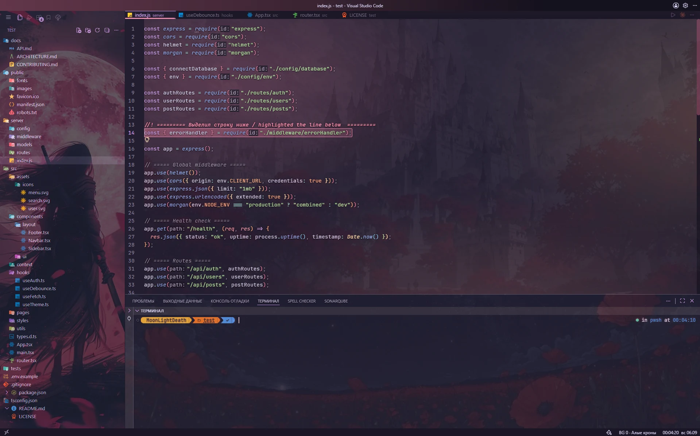<br><sub><b>Crimson Crowns</b> · photo</sub></td>
    <td align="center" width="33%">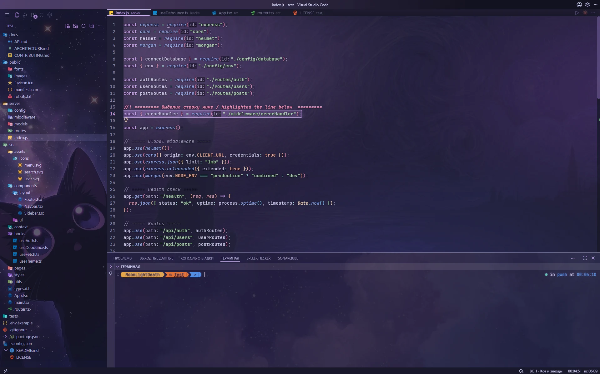<br><sub><b>Cat and Stars</b> · photo</sub></td>
    <td align="center" width="33%">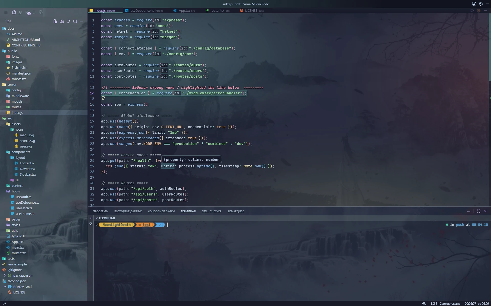<br><sub><b>Mist Scroll</b> · photo</sub></td>
  </tr>
  <tr valign="top">
    <td align="center">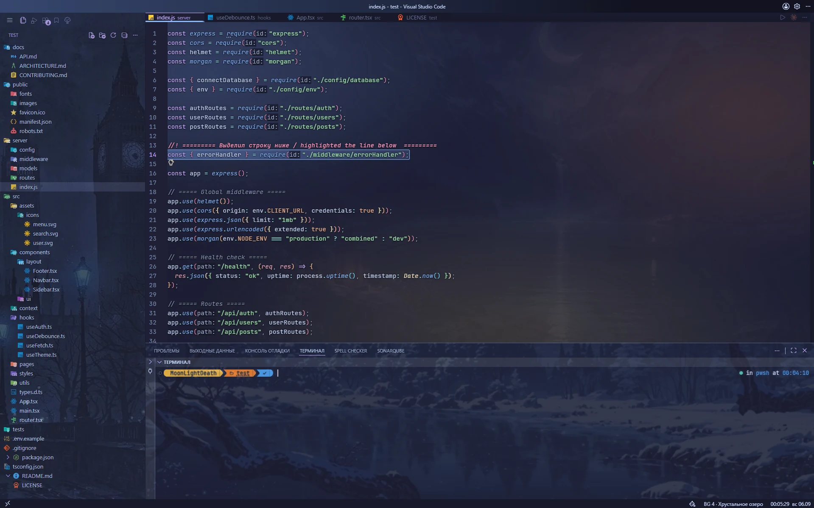<br><sub><b>Crystal Lake</b> · photo</sub></td>
    <td align="center">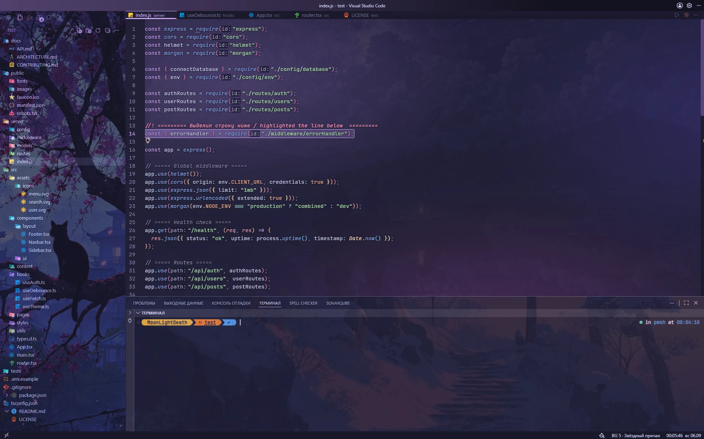<br><sub><b>Star Pier</b> · photo</sub></td>
    <td align="center">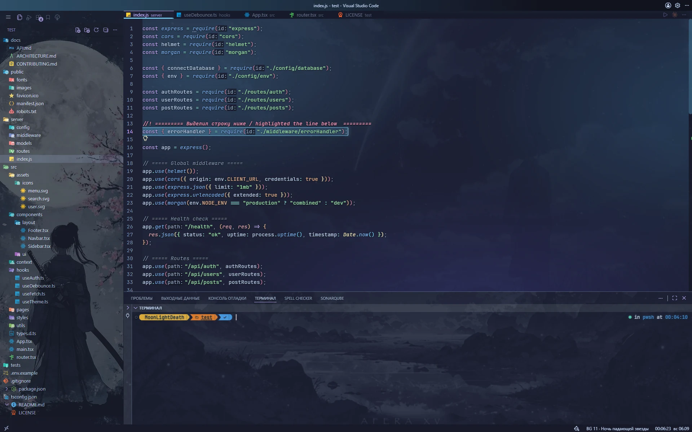<br><sub><b>Falling Star Night</b> · photo</sub></td>
  </tr>
  <tr valign="top">
    <td align="center">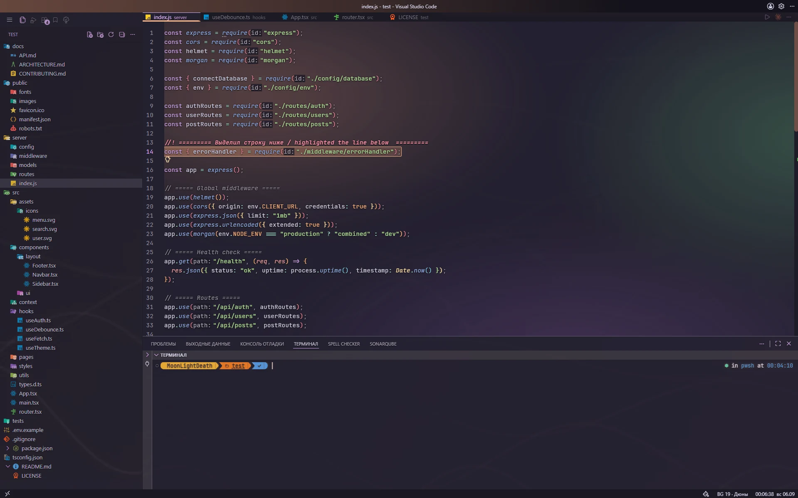<br><sub><b>Dunes</b> · procedural</sub></td>
    <td align="center">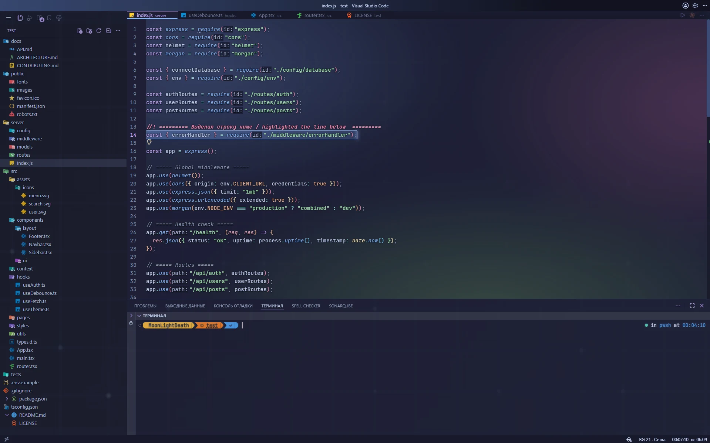<br><sub><b>Grid</b> · procedural</sub></td>
    <td align="center">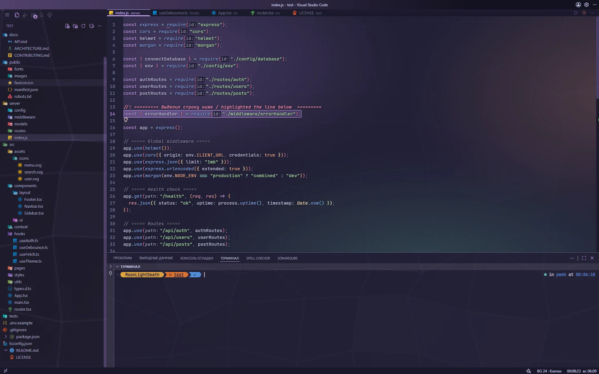<br><sub><b>Cells</b> · procedural</sub></td>
  </tr>
</table>

> **Generative sets** don't use images: zones are filled with a CSS gradient from the set palette, so
> they weigh nothing and need no path setup. **Procedural sets** also need no assets but draw a
> texture on a canvas and cache it; if canvas is unavailable, the zone softly falls back to a
> gradient. Any zone of any set can be overridden with your own image.

---

## The panel by tabs

After install a **`BG N`** button appears at the bottom-right. Click it to open the **Background &
design** panel. At the top is the master toggle; below it settings are laid out across **five tabs**
(one visible at a time, so the panel stays short); sections inside a tab collapse.

<table>
  <tr>
    <th align="center">Sets</th>
    <th align="center">View</th>
    <th align="center">Terminal</th>
    <th align="center">System</th>
    <th align="center">Data</th>
  </tr>
  <tr valign="top">
    <td align="center">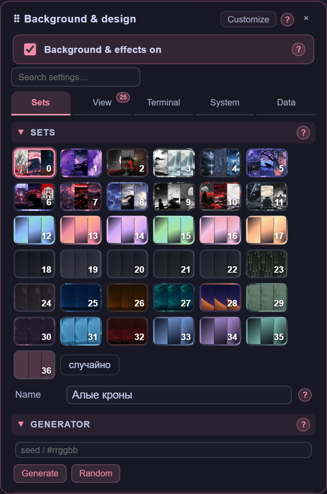</td>
    <td align="center">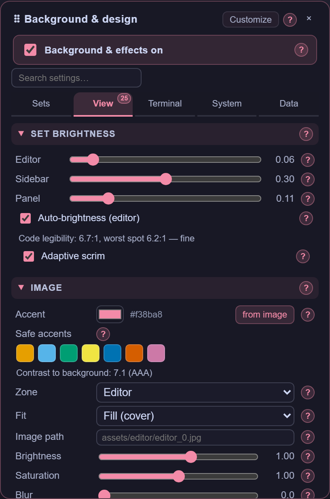</td>
    <td align="center">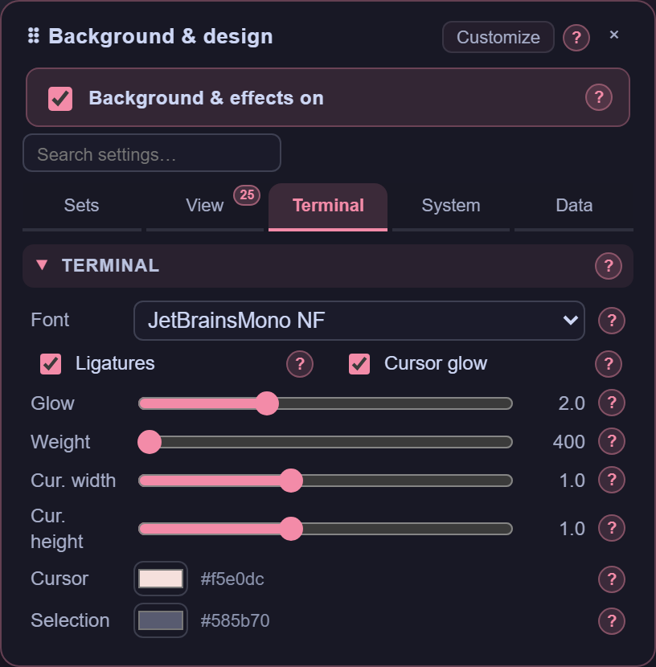</td>
    <td align="center">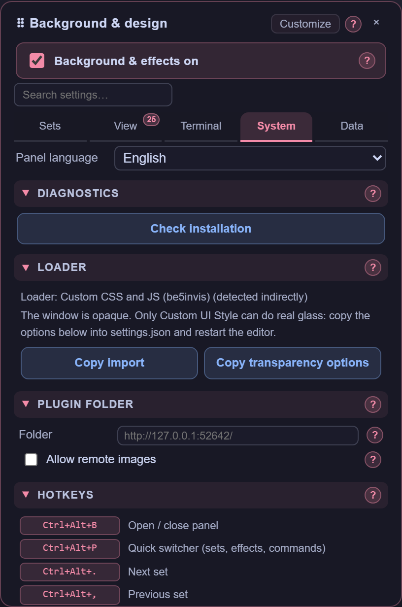</td>
    <td align="center">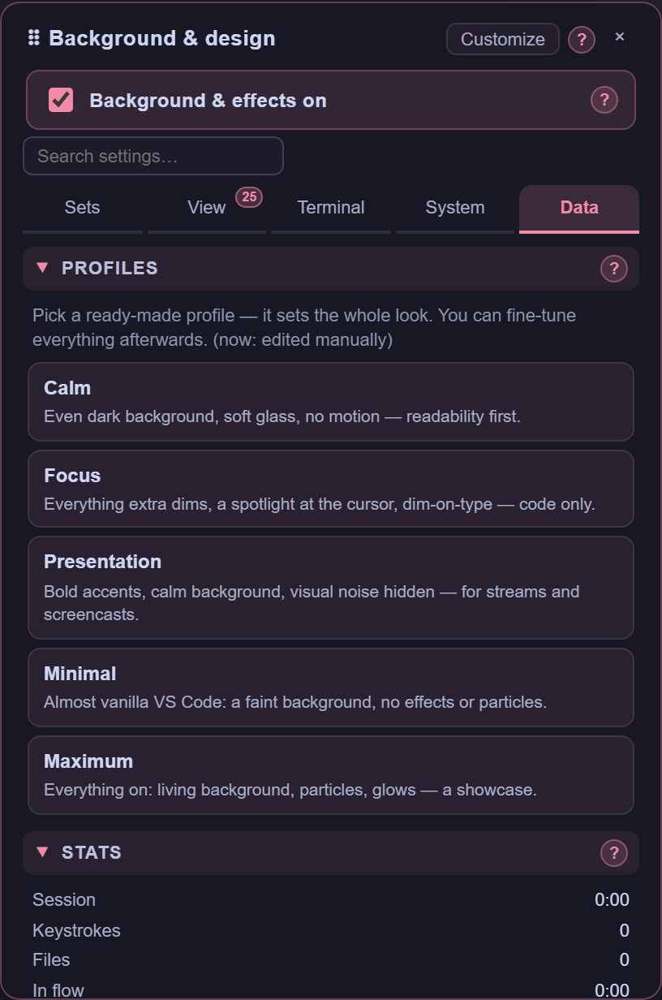</td>
  </tr>
</table>

- **Sets** — set chips with previews (hover previews, click selects; a red "!" means an image failed
  to load), plus **Generator**, **Slideshow**, **By time of day** and **By project**.
- **View** — **Set brightness**, **Image** (accent, filters and a custom image path per zone) and
  **Effects** — ~50 toggles with a search filter, then "Strength" sliders, particle style and the
  **FPS auto-budget**.
- **Terminal** — font, ligatures, glow, cursor and selection.
- **System** — panel language (**RU / EN / Auto**), install **Diagnostics**, **Plugin folder** and a
  hotkeys reference.
- **Data** — quick-start **Profiles**, **Presets**, **Sync** via `settings.json`, **Share** by code,
  **Theme export**, **Export / import** to JSON with auto-backup, Undo/Redo and reset to defaults.

The active tab is **remembered between sessions**; a panel auto-rebuild (slideshow, set change) does
not reset you to the first tab. Drag the panel by its header; `Esc` or a click outside closes it.

---

## Installation

1. **Install** `be5invis.vscode-custom-css` (Marketplace, or
   `code --install-extension be5invis.vscode-custom-css`). It performs the actual injection.
2. **Get the plugin** — clone or download this repo somewhere permanent.
3. **Register the path to `custom-bg.js`** in your VS Code `settings.json`:
   ```jsonc
   "vscode_custom_css.imports": [
     "file:///d:/path/to/vscode-bg/custom-bg.js"
   ]
   ```
   > A `file:///` URL with the absolute path to **your** `custom-bg.js`. On Windows: forward
   > slashes and a lowercase drive letter (`file:///d:/...`).
   >
   > Or run `npm run setup` (`node install.js`) — it finds your editors and writes the import for you
   > (makes a backup first; leaves JSONC settings untouched and shows a snippet instead).
4. **Enable and restart** — `Ctrl+Shift+P` → **Enable Custom CSS and JS**, then fully restart
   (`File → Exit`, not just reload).

**If the background didn't appear** — see [FAQ](#faq--troubleshooting) or open System → Check
installation in the panel.

> **After a VS Code update** the custom-css injection is usually lost — re-run **Enable Custom CSS
> and JS** and restart. The optional companion extension (`extension/`) detects this and reminds you.

---

## FAQ / Troubleshooting

**No `BG` button / no background.** Make sure `be5invis.vscode-custom-css` is installed, the path in
`vscode_custom_css.imports` points exactly to your `custom-bg.js`, Custom CSS is enabled, and you
**fully** restarted VS Code. Check the version line in `Help → Toggle Developer Tools` → Console:
`[MoonLight custom-bg] v19 …`. If it's missing, the script wasn't loaded (check the path and slashes).

**The background vanished after moving the folder.** The set images are read relative to the plugin
folder. Open the panel → System → **Plugin folder** and point it at the folder that contains
`assets/`, or fix the path in `settings.json`.

**"Your Code installation appears to be corrupt".** Harmless — VS Code notices custom-css patched its
files. Click "Don't show again", or install a checksum-fix extension.

**It broke after a VS Code update.** Re-run **Enable Custom CSS and JS** and restart — the injection
is lost on updates (a limitation of the mechanism, not this plugin).

**Web / Codespaces.** The custom background is desktop-only (custom-css can't patch the web
workbench), but the **MoonLight themes** work there — pick one via `Color Theme`.

Still stuck / found a bug / have an idea?
[Issues](https://github.com/moonlivedt-oss/custom_VScode/issues) ·
[Discussions](https://github.com/moonlivedt-oss/custom_VScode/discussions).

---

## Build

Modules do **not** use `import`/`export` — they live in one scope and `build.js` concatenates them in
order (from the `FILES` list) into a single IIFE. `custom-bg.js` is a **generated** file: edit
`src/**`, then `node build.js`, and commit both together (CI checks they match).

```bash
node build.js        # rebuild custom-bg.js        (or: npm run build)
node test/smoke.js   # smoke test                   (or: npm test)
npm run check        # build + smoke in one command
npm run build:min    # minified custom-bg.min.js (safe stripper, -44%)
```

<details>
<summary>Playwright: integration test and screenshot generation (dev dependency)</summary>

```bash
npm i -D @playwright/test && npx playwright install chromium   # once
npm run test:e2e     # a real Chromium opens the panel and checks button/injection/localization
npm run screenshots  # regenerates docs/screenshots/menu-<lang>-<tab>.png (RU/EN x 5 tabs)
```

Playwright is not part of the zero-dependency main flow — it's only needed for e2e and screenshots.

</details>

See [CONTRIBUTING.md](CONTRIBUTING.md) for the module layout, coding conventions and how to add a set.

---

## Security

Everything external (imported JSON, the "Share" code, `localStorage`) goes through `mergeCfg`, which
accepts only values of a known type and range; strings that reach CSS are escaped, so CSS injection
is impossible. Remote images are **off by default** — an imported or foreign config can't make the
editor go online. See [SECURITY.md](SECURITY.md) for the threat model and how to report a
vulnerability.

---

## License

MIT — see [LICENSE](LICENSE). Background sets and palettes are part of the project; use, change and share.

---

<div align="center">
  <sub><b>MoonLight custom-bg</b> — one script, zero dependencies, the whole look in your hands.</sub>
  <br>
  <sub>Found a bug or have an idea? — <a href="https://github.com/moonlivedt-oss/custom_VScode/issues">Issues</a> · <a href="https://github.com/moonlivedt-oss/custom_VScode/discussions">Discussions</a></sub>
</div>
