<div align="center">

**Русский** · [English](README.en.md)

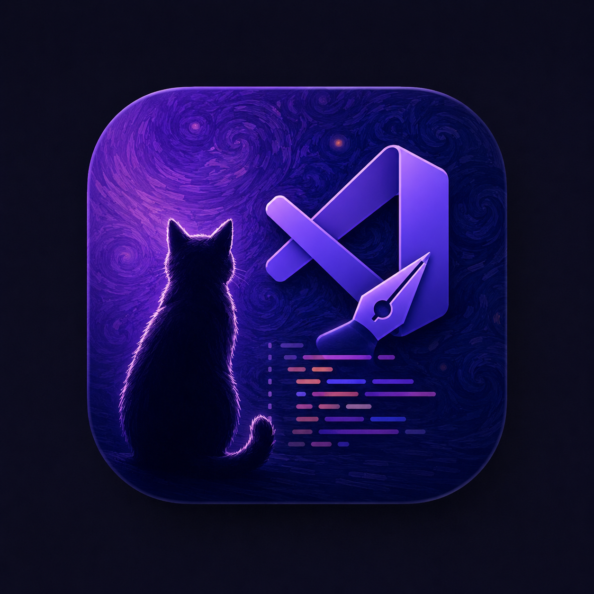

# MoonLight custom-bg

### Живой фон и полноценная панель оформления для VS Code — прямо в редакторе

Картинки по зонам · наборы с собственной палитрой · генеративные фоны без ассетов · слайдшоу<br>
Ken Burns, матовое стекло, Aurora, спотлайт · фон под проект · виджеты статусбара · интерфейс RU / EN

[](https://github.com/moonlivedt-oss/custom_VScode/actions/workflows/ci.yml)


<sub>Один самодостаточный скрипт · ноль npm-зависимостей · настройка в пару кликов, без правки файлов</sub>

</div>

---

## Быстрый старт

1. Поставь **загрузчик** — расширение, которое внедряет скрипт в окно редактора. Подойдёт любое
   из двух:
   - **Custom UI Style** (рекомендуется) — `code --install-extension subframe7536.custom-ui-style`.
     Он делает бэкап оригиналов редактора и восстанавливает их перед каждым патчем, поэтому
     **переживает обновления VS Code**, гасит предупреждение «installation appears corrupt» и
     умеет настоящую прозрачность окна.
   - **Custom CSS and JS** — `code --install-extension be5invis.vscode-custom-css`. Классический
     путь; инжект слетает после каждого обновления редактора и его нужно включать заново.
2. Склонируй репозиторий: `git clone https://github.com/moonlivedt-oss/custom_VScode.git`
3. Пропиши путь к `custom-bg.js` — проще всего командой `npm run setup` (она сама определит, какой
   загрузчик стоит, и запишет импорт в нужном формате, сделав резервную копию настроек).
   Вручную, `Ctrl+Shift+P` → *Open User Settings (JSON)*:
   ```jsonc
   // Custom UI Style
   "custom-ui-style.external.imports": [
     { "type": "js", "url": "file:///d:/path/to/vscode-bg/custom-bg.js" }
   ]
   // или Custom CSS and JS
   "vscode_custom_css.imports": [
     "file:///d:/path/to/vscode-bg/custom-bg.js"
   ]
   ```
4. Примени: для Custom UI Style — `Ctrl+Shift+P` → **Custom UI Style: Reload**; для Custom CSS —
   `Ctrl+Shift+P` → **Enable Custom CSS and JS**. Затем **полностью перезапусти** VS Code
   (`File → Exit`).

Готово — справа в статусбаре появится кнопка **`BG 0`**, по клику открывается панель **«Фон и
дизайн»**. Какой загрузчик активен, видно в панели: «Система → Загрузчик».

> Интерфейс двуязычный: язык берётся из языка VS Code или задаётся вручную в
> **«Система → Язык панели»** (Авто / Русский / English).
>
> **Настоящая прозрачность окна** (Mica / vibrancy): нужна связка Custom UI Style + опции
> Electron. Готовые строки для `settings.json` кладёт в буфер кнопка «Система → Загрузчик →
> Скопировать опции прозрачности»; затем включи эффект «Настоящая прозрачность» на вкладке «Вид».

## Что это

Обычные темы VS Code меняют только цвета. Плагины «картинка на фон» ставят одну статичную
картинку на весь редактор — и на этом всё.

**MoonLight custom-bg** идёт дальше: это один самодостаточный скрипт, который подгружается в
интерфейс VS Code через расширение [`be5invis.vscode-custom-css`](https://marketplace.visualstudio.com/items?itemName=be5invis.vscode-custom-css)
и добавляет полноценную панель оформления прямо в редактор.

| | Обычная тема | Плагин «картинка на фон» | MoonLight custom-bg |
|---|---|---|---|
| Своя картинка | нет | да (одна на всё) | **да, отдельно на редактор / сайдбар / панель** |
| Наборы с палитрой | нет | нет | **да, 20 фото-наборов, у каждого свой акцент** |
| Наборы без картинок | нет | нет | **да, 6 градиентных + 7 процедурных наборов (ноль ассетов)** |
| Палитра интерфейса из картинки | нет | нет | **да, «живой контур» красится цветами фона** |
| Фон под открытый проект | нет | нет | **да, набор закрепляется за папкой (и в форках: Cursor / VSCodium / Windsurf)** |
| Слайдшоу по таймеру | нет | нет | **да, с предзагрузкой (без «моргания»)** |
| Настройка без правки файлов | частично | нет | **да, панель прямо в редакторе + поиск по настройкам** |
| Отмена изменений | нет | нет | **да, Undo/Redo вида (`Ctrl+Alt+Z` / `Ctrl+Alt+Y`)** |
| Эффекты (Ken Burns, стекло, акрил, живой фон, анимации UI, шлейф курсора, тон) | нет | нет | **да, ~50 штук** |
| Читаемость кода поверх картинки | — | нет | **да: адаптивный скрим по карте яркости + метр контраста с авто-починкой** |
| Настоящая прозрачность окна | нет | нет | **да, через Custom UI Style (Mica / vibrancy)** |
| Виджеты статусбара | нет | нет | **да: часы, помидор-таймер, частицы (в т.ч. сезонные)** |
| Язык интерфейса | — | — | **RU / EN (авто по языку VS Code или вручную)** |
| Профили / энергосбережение | нет | нет | **да: 5 профилей в 1 клик + авто-бюджет FPS** |
| Установка | вручную | вручную | **`npm run setup` — прописывает путь автоматически** |
| Внешние зависимости | — | — | **нет (0 npm-пакетов)** |

---

## Возможности

Всё настраивается в панели **«Фон и дизайн»** (кнопка `BG N` в статусбаре):

> **Новое в v20:**
> - **Адаптивный скрим** — фон гасится точечно там, где он светлее комфортного порога (карта
>   яркости 8×8), а не целиком ползунком: яркое окно за кодом больше не мешает, остальная
>   картина остаётся видимой.
> - **Метр читаемости** — контраст кода к реальной подложке числом, с кнопкой «Исправить»,
>   которая сама подбирает прозрачность до порога WCAG AA.
> - **Палитра в OKLab** — акцент из картинки считается в перцептивном пространстве (как
>   pywal / Material You), а не в HSL: цвета перестали быть «то ядовитыми, то невидимыми».
> - **Мгновенный первый кадр** — метрики и мини-превью картинок кэшируются: на старте больше
>   нет ни пустого фона, ни прыжка акцента.
> - **Ползунки без рывков** — числа переехали в CSS-переменные, лист стиля при перетаскивании
>   не пересобирается.
> - **Два загрузчика** — работает и через `be5invis.vscode-custom-css`, и через
>   `subframe7536.custom-ui-style`; второй переживает обновления VS Code и открывает
>   **настоящую прозрачность окна** (Mica / vibrancy), а не только «стекло» внутри окна.
> - **Здоровье селекторов** в диагностике — видно, какие элементы вёрстки VS Code перестали
>   находиться после обновления редактора.
> - **Шейдерные наборы** на WebGL и **8 новых фото-наборов** из одной мастер-картинки
>   (втрое меньше файлов, зоны одной палитры).
> - **Быстрый переключатель** `Ctrl+Alt+P` с живым превью и **синхронизация окон** VS Code.

- **Наборы фонов** — 12 фото-наборов (картинки для редактора / сайдбара / панели), 8
  **мастер-наборов** (один кадр 21:9 на весь набор, зоны — его вырезы), 4 **шейдерных** (кадр
  считает GPU), 6 **генеративных** наборов-градиентов и 7 **процедурных** (звёздное поле, дюны, грейн, сетка,
  топография, матрица, клетки — текстура рисуется на canvas, без единого ассета). Генеративные и процедурные грузятся
  мгновенно и работают на любой машине; у каждой зоны своя форма градиента — диагональ в
  редакторе, обратная в сайдбаре, радиальная в панели. Выбор набора или «случайно». У
  каждого набора **свой акцентный цвет** — переключение перекрашивает интерфейс под палитру
  набора. Имя набора можно **переименовать прямо в панели** — оно показывается на кнопке
  `BG` и в списках. При наведении на чип набора его фон **плавно примеряется** без клика.
- **Поиск по панели** — поле над вкладками: набери часть названия («терм», «пресет», «виньет»)
  и перейди к нужной секции или эффекту на любой вкладке — с разворотом и подсветкой.
- **Отмена / повтор** — пошаговый Undo/Redo вида в пределах сессии: кнопки в «Система» или
  `Ctrl+Alt+Z` / `Ctrl+Alt+Y`. Авто-смены слайдшоу и по времени в историю не попадают.
- **Диагностика установки** — «Система» → «Проверить установку»: отчёт (версия, тема, набор,
  папка и загрузка картинок, активен ли custom-css) с копией в буфер — удобно приложить к issue.
- **Фон под проект** — набор закрепляется за открытой папкой (по имени в заголовке окна): рабочий
  репозиторий открывается со спокойным набором, пет-проект — со своим. Имеет приоритет над
  слайдшоу и авто-набором по времени. Работает и в форках VS Code (Cursor / VSCodium / Windsurf /
  Code - OSS) — имя проекта читается из их заголовка тоже.
- **Палитра из картинки** — из фоновой картинки редактора извлекается гармоничная палитра, и
  «живой контур» перекрашивается её цветами вместо радужного дефолта. Плюс кнопка
  **«Акцент из картинки»** — берёт доминирующий цвет как акцент набора.
- **Параллакс** — фоновая картинка редактора едва заметно смещается вслед за курсором, создавая
  глубину. Уважает системную «уменьшить движение».
- **Поток** — чем дольше печатаешь без пауз, тем сильнее гаснет фон редактора (глубже обычного
  «Тускнеть при печати»); на паузе для чтения возвращается.
- **Пресеты** — сохранить весь текущий вид (набор, яркость, эффекты, терминал, акцент) под именем
  и переключаться между образами одним кликом (до 24 штук).
- **Поделиться образом** — короткий код всего вида (без картинок и путей): скопируй свой или
  примени чужой прямо в панели.
- **Слайдшоу** — авто-смена набора по кругу через интервал (1–120 мин) с предзагрузкой.
- **Авто-набор по времени суток** — днём один набор, ночью другой; границы дня настраиваются
  (часы 0–23, поддерживается интервал через полночь).
- **Индикатор ветки git** — тонкая полоска у верхнего края окна: на `main`/`master` — красноватая,
  на фиче-ветках — зеленоватая (ветка читается из статусбара).
- **Светлая и тёмная тема** — поверхности «стекла», титлбара и скрима берут реальные цвета
  активной темы (`--vscode-*`), переключение применяется на лету. Сама панель тоже
  **подстраивается под тему**.
- **Мастер-выключатель** — одним тумблером (или `Ctrl+Alt+0`) снять весь фон и эффекты и получить
  обычный VS Code, не теряя настройки.
- **Горячие клавиши** — `Ctrl+Alt+P` — быстрый переключатель наборов и эффектов, `Ctrl+Alt+B` открывает панель, `Ctrl+Alt+.` / `Ctrl+Alt+,` листают наборы,
  `Ctrl+Alt+0` — вкл/выкл фон, `Ctrl+Alt+R` — режим чтения, `Ctrl+Alt+Z` / `Ctrl+Alt+Y` — отмена/повтор.
- **Яркость по зонам** + **авто-яркость editor** (для светлых артов прозрачность занижается сама).
- **Картинка** — акцентный цвет (свой на набор), фильтры фоновой картинки по зонам (вписывание
  cover / contain, яркость / насыщенность / размытие) и **свой путь картинки** на зону.
- **Эффекты** — Ken Burns, матовое стекло, виньетка, свечение курсора, живой контур и др. Из
  свежего: **тон акцентом** (тонировка всего воркбенча под палитру набора), **читаемость кода**
  (мягкая тень глифов над картинкой — без сдвига курсора), **реакция на ошибки** (статусбар
  мягко пульсирует красным, когда в коде есть ошибки), а также **режим чтения** (`Ctrl+Alt+R`),
  **тускнеть неактивные** группы, **стекло палитры/sticky**, **акцент поиска/отступов**,
  **миникарта сквозь фон**, **совпадения слова**, **Aurora**, **спотлайт**, **пульс печати**.
  Эффектов уже около **50** — над списком есть **поиск-фильтр**, а у каждой вкладки — указатель секций.
- **Терминал** — шрифт (Nerd), лигатуры, жирность, свечение, цвет и размер курсора / выделения.
- **Виджеты статусбара** — часы, таймер-помидор, летящие частицы (перекрашиваются под акцент). У
  частиц выбирается **стиль**: точки / звёзды / снег / сакура / пузыри / светлячки / дождь /
  конфетти, а также **«Сезон (авто)»** — форма сама подбирается по времени года (зима — снег,
  весна — сакура, лето — светлячки, осень — дождь).
- **Папка плагина** — путь к картинкам задаётся **прямо в панели** (не нужно править исходник при
  переносе плагина; пусто — путь определяется автоматически).
- **Экспорт / импорт / авто-резерв** — настройки в JSON; перед импортом / сбросом / применением
  пресета текущий вид уходит в резерв, кнопка «Восстановить прежние настройки» откатывает.
  Всё запоминается между запусками.

---

## Наборы фонов

Набор бывает четырёх видов: **фото** (три отдельные картинки — редактор / сайдбар / панель),
**мастер-кадр** (один кадр 21:9 на весь набор, зоны — его вырезы), **генеративный/процедурный**
(рисуется из палитры, без ассетов) и **шейдерный** (кадр считает GPU). У каждого свой акцентный
цвет; акцент можно переопределить вручную — правка хранится только для этого набора.

### Как устроен мастер-кадр


<sub>Один файл вместо трёх: <b>зелёным</b> — вырез сайдбара (левые 16% кадра), <b>синим</b> —
редактор (правые 56%, самая спокойная часть кадра), <b>оранжевым</b> — панель (нижние 22%).
Композиция подобрана так, чтобы сюжет жил слева и внизу, а за кодом оставалось тихое место.
Вырезы считает <code>scripts/import-master.js</code>: он измеряет кадр сеткой яркости, выбирает
спокойную половину под редактор и печатает готовую запись для <code>SETS</code>.</sub>

| # | Набор | Акцент | Тип |
|---|-------|--------|-----|
| 0 | Алые кроны | `#f38ba8` | фото |
| 1 | Кот и звёзды | `#cba6f7` | фото |
| 2 | Полночные маки | `#f38ba8` | фото |
| 3 | Свиток тумана | `#94e2d5` | фото |
| 4 | Хрустальное озеро | `#89b4fa` | фото |
| 5 | Звёздный причал | `#cba6f7` | фото |
| 6 | Багряный портал | `#f5c2e7` | фото |
| 7 | Ведьмин чертог | `#f38ba8` | фото |
| 8 | Лунная цитадель | `#89b4fa` | фото |
| 9 | Тень мастера | `#94e2d5` | фото |
| 10 | Меч в маках | `#eba0ac` | фото |
| 11 | Ночь падающей звезды | `#74c7ec` | фото |
| 12 | Аврора | `#89b4fa` | градиент |
| 13 | Закат | `#f38ba8` | градиент |
| 14 | Неон | `#cba6f7` | градиент |
| 15 | Мох | `#a6e3a1` | градиент |
| 16 | Сакура | `#f5c2e7` | градиент |
| 17 | Янтарь | `#fab387` | градиент |
| 18 | Звёздное поле | `#89b4fa` | процедурный |
| 19 | Дюны | `#fab387` | процедурный |
| 20 | Грейн | `#a6e3a1` | процедурный |
| 21 | Сетка | `#89b4fa` | процедурный |
| 22 | Топография | `#94e2d5` | процедурный |
| 23 | Матрица | `#a6e3a1` | процедурный |
| 24 | Клетки | `#cba6f7` | процедурный |
| 25 | Неоновый дождь | `#94b9f1` | мастер-кадр |
| 26 | Свечной зал | `#e4a97e` | мастер-кадр |
| 27 | Сияние фьорда | `#7bc1e8` | мастер-кадр |
| 28 | Дюны под звёздами | `#f3a173` | мастер-кадр |
| 29 | Бамбук в тумане | `#83c9a3` | мастер-кадр |
| 30 | Сакура у фонаря | `#c5a9e6` | мастер-кадр |
| 31 | Ледяная пещера | `#7bc1ed` | мастер-кадр |
| 32 | Кровавая луна | `#eca19d` | мастер-кадр |
| 33 | Сияние GPU | `#89b4fa` | шейдер |
| 34 | Плазма | `#cba6f7` | шейдер |
| 35 | Туманность | `#94e2d5` | шейдер |
| 36 | Свой шейдер | `#89b4fa` | шейдер |

> Палитра акцентов — в духе [Catppuccin](https://github.com/catppuccin/catppuccin).
> **Генеративные наборы** (12–17) не используют картинок: зоны заливаются CSS-градиентом из
> палитры набора, поэтому они ничего не весят и работают без настройки путей. У каждой зоны
> своя форма градиента (диагональ / обратная диагональ / радиальный), чтобы редактор, сайдбар
> и панель не выглядели одинаково.
> **Процедурные наборы** (18–24) тоже без ассетов, но вместо плоского градиента рисуют
> текстуру на canvas (звёздное поле / волны-дюны / плёночный грейн / сетка / топография /
> матрица / клетки) и кэшируют её; если canvas недоступен, зона мягко откатывается на градиент.
> **Мастер-кадры** (25–32) — один файл 21:9 на весь набор (см. разметку вырезов выше): втрое
> меньше ассетов и гарантированно единая палитра зон. У светлых кадров («Бамбук в тумане»,
> «Ледяная пещера») своя пониженная стартовая прозрачность, чтобы код читался сразу.
> **Шейдерные наборы** (33–36) считает видеокарта (WebGL): фон медленно течёт, ассетов ноль.
> Слой стоит при скрытом окне, уважает «уменьшить движение» и авто-бюджет FPS, а если WebGL
> недоступен — набор молча показывает градиент своей палитры. «Свой шейдер» рисует GLSL,
> написанный в панели («Набор → Шейдер»).
> В любую зону любого набора можно подложить
> свою картинку — она перекроет градиент/текстуру.

### Галерея: наборы вживую

Один и тот же код — девять разных наборов. Каждый перекрашивает интерфейс под свою палитру:
акцент, скроллбар, курсор, рамки, подсветку строки — всё меняется вместе с фоном.

<table>
  <tr valign="top">
    <td align="center" width="33%"><br><sub><b>Алые кроны</b> · фото</sub></td>
    <td align="center" width="33%"><br><sub><b>Кот и звёзды</b> · фото</sub></td>
    <td align="center" width="33%">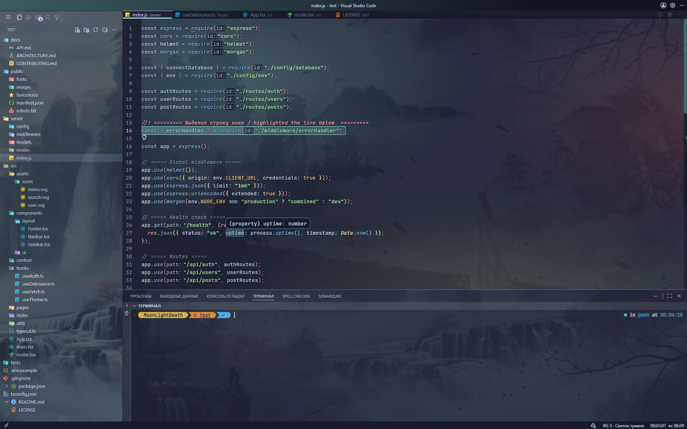<br><sub><b>Свиток тумана</b> · фото</sub></td>
  </tr>
  <tr valign="top">
    <td align="center">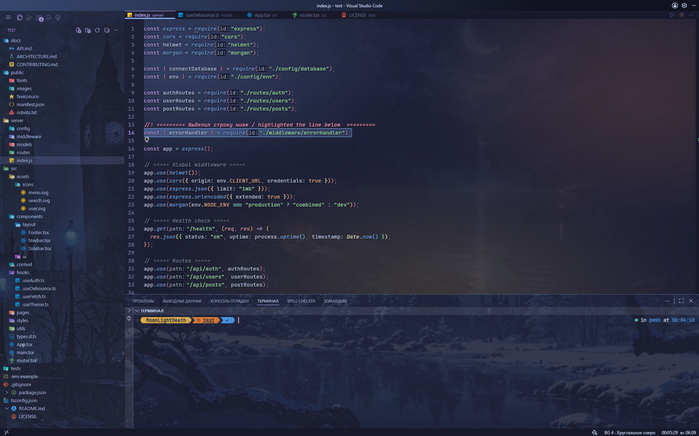<br><sub><b>Хрустальное озеро</b> · фото</sub></td>
    <td align="center">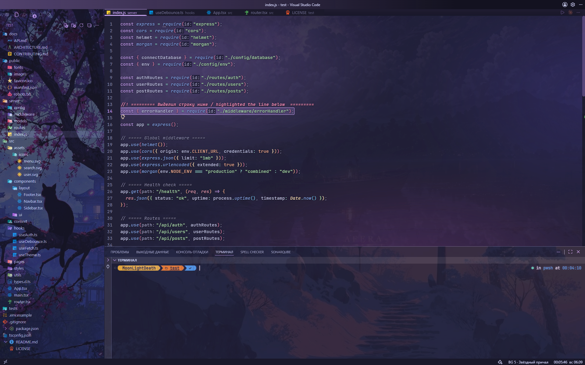<br><sub><b>Звёздный причал</b> · фото</sub></td>
    <td align="center">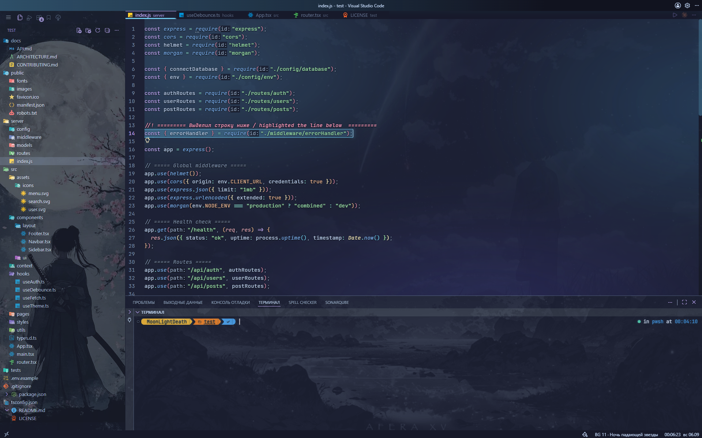<br><sub><b>Ночь падающей звезды</b> · фото</sub></td>
  </tr>
  <tr valign="top">
    <td align="center">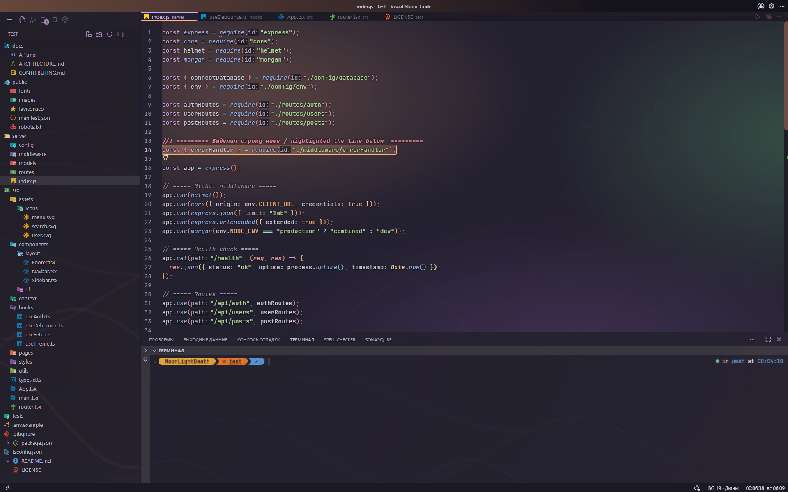<br><sub><b>Дюны</b> · процедурный</sub></td>
    <td align="center">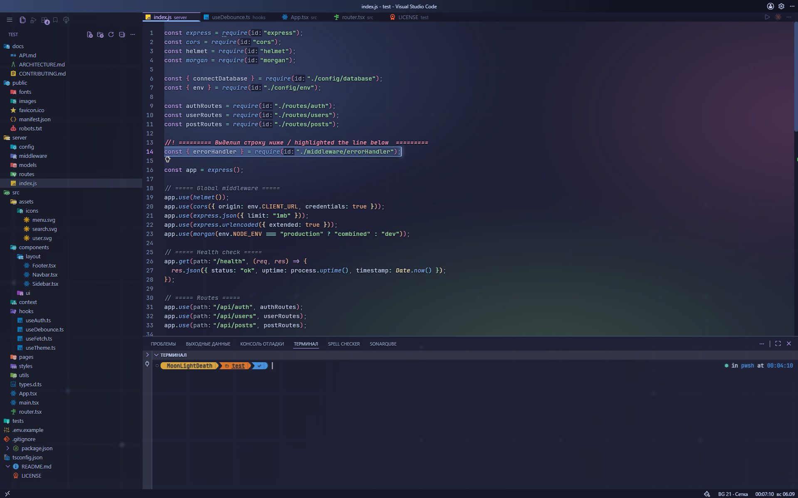<br><sub><b>Сетка</b> · процедурный</sub></td>
    <td align="center">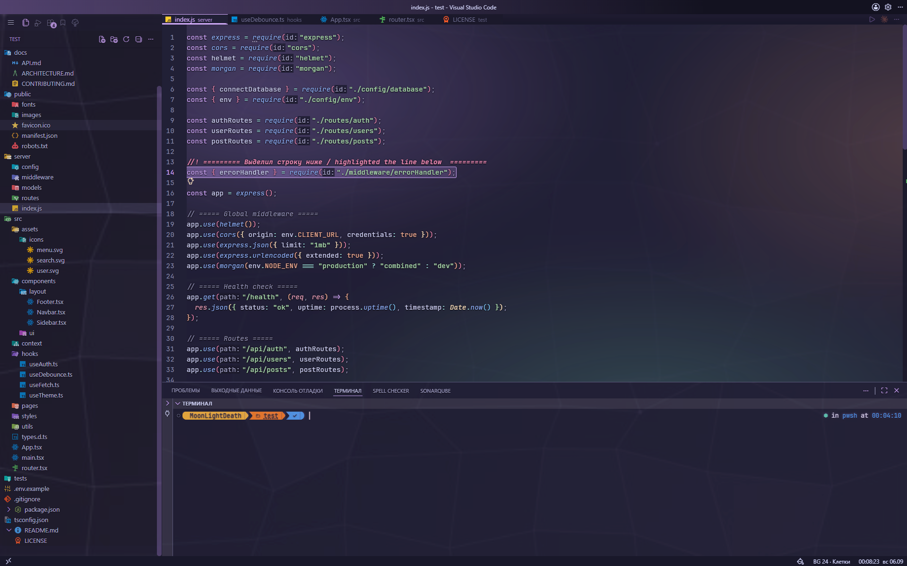<br><sub><b>Клетки</b> · процедурный</sub></td>
  </tr>
</table>

<sub>Ещё 16 наборов — в таблице выше; фон переключается кнопкой <code>BG</code> или <code>Ctrl+Alt+.</code></sub>

---

## Установка

Скрипт подгружается расширением **be5invis.vscode-custom-css**, а не устанавливается как обычное
расширение из Marketplace.

1. **Поставь расширение** `be5invis.vscode-custom-css` (через Marketplace или
   `code --install-extension be5invis.vscode-custom-css`).

2. **Склонируй репозиторий** в удобную папку:
   ```bash
   git clone https://github.com/moonlivedt-oss/custom_VScode.git
   ```

3. **Пропиши путь к `custom-bg.js`** в `settings.json` VS Code
   (`Ctrl+Shift+P` → *Preferences: Open User Settings (JSON)*):
   ```jsonc
   "vscode_custom_css.imports": [
     "file:///d:/путь/до/vscode-bg/custom-bg.js"
   ]
   ```
   > Путь — в формате `file:///` c абсолютным адресом до **твоего** `custom-bg.js`.
   > На Windows буква диска в нижнем регистре, слэши прямые (`/`).
   >
   > **Проще:** запусти `npm run setup` (или `node install.js`) — установщик сам найдёт
   > `settings.json` VS Code и форков (Cursor / VSCodium / Windsurf) и добавит путь, сделав
   > резервную копию. Если настройки в формате JSONC (с комментариями), он их **не тронет**,
   > а покажет готовый сниппет для ручной вставки. `node install.js --dry` — показать без записи.

4. **Включи** кастомный CSS: `Ctrl+Shift+P` → **Enable Custom CSS and JS**.

5. **Полностью перезапусти** VS Code (`File → Exit`, не просто закрыть окно).

6. **Укажи «Папку плагина»** (если фон пустой). Открой кнопку **`BG`** → секцию
   **«Папка плагина»** и впиши путь к папке с `assets`, например
   `vscode-file://vscode-app/d%3A/путь/до/vscode-bg/` (двоеточие диска — как `%3A`).
   Нажми Enter — путь сохранится в `localStorage` **этой машины** (не в коде и не в репозитории).

> **Почему фон может быть пустым?** custom-css часто внедряет скрипт инлайном, и тогда плагин
> не может сам определить, где лежат картинки. Плитки наборов показывают «!», а фон не грузится —
> пока не укажешь путь в шаге 6. Это разовая настройка на каждую машину. Пустое поле = плагин
> пытается определить путь автоматически (работает не всегда).
>
> **Перенёс папку и фон пропал?** То же самое — обнови путь в секции **«Папка плагина»**.
> Править исходник и пересобирать не нужно.

> Внимание: после каждого обновления VS Code расширение custom-css нужно включать заново
> (`Enable Custom CSS and JS` + перезапуск) — это ограничение самого механизма, не плагина.

**Проверка версии:** `Help → Toggle Developer Tools` → вкладка Console → строка
`[MoonLight custom-bg] v19 …`.

---

## Как пользоваться

После установки в статусбаре (правый нижний угол) появится кнопка **`BG N`**, где `N` — номер
активного набора. Клик по ней открывает панель **«Фон и дизайн»**. Сверху — мастер-тумблер, под
ним настройки разложены по **пяти вкладкам** (видна одна за раз, поэтому панель короткая), а
секции внутри вкладки по-прежнему сворачиваются:

- **Набор** — плитки-чипы наборов с превью (наведение плавно примеряет набор, клик выбирает,
  «случайно» — случайный выбор при старте; красный «!» = картинка не загрузилась, у генеративных
  не бывает), а также **Генератор**, **Слайдшоу**, **По времени суток** и **По проекту** (фон под
  открытый проект + полоска-индикатор git-ветки).
- **Вид** — **Яркость набора** (прозрачность по зонам + авто-яркость), **Картинка** (акцентный
  цвет, фильтры и свой путь картинки по зонам) и **Эффекты** — ~50 тумблеров с поиском-фильтром
  сверху, ниже — «Сила» (числовые параметры), стиль частиц и **авто-бюджет FPS**. Параметры,
  зависящие от выключенного эффекта, показываются только когда эффект включён.
- **Терминал** — шрифт, лигатуры, свечение, курсор и выделение.
- **Система** — язык панели (**RU / EN / Авто**), **Диагностика** установки, **Папка плагина**
  (путь к картинкам + «Разрешить сетевые картинки», по умолчанию выкл) и справка по горячим клавишам.
- **Данные** — **Профили** быстрого старта, **Пресеты**, **Синхронизация** через `settings.json`,
  **Поделиться** кодом, **Экспорт темы** VS Code, **Экспорт / импорт** в JSON с авто-резервом,
  Undo/Redo и сброс к дефолту.

Активная вкладка **запоминается между запусками**, а авто-пересборка панели (слайдшоу, смена
набора) не сбрасывает тебя на первую вкладку.

<table>
  <tr>
    <th align="center">Набор / Sets</th>
    <th align="center">Вид / View</th>
    <th align="center">Терминал / Terminal</th>
    <th align="center">Система / System</th>
    <th align="center">Данные / Data</th>
  </tr>
  <tr valign="top">
    <td align="center">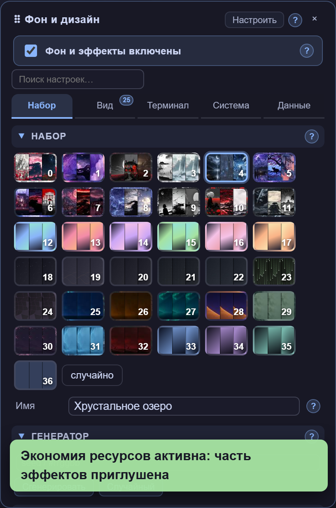</td>
    <td align="center">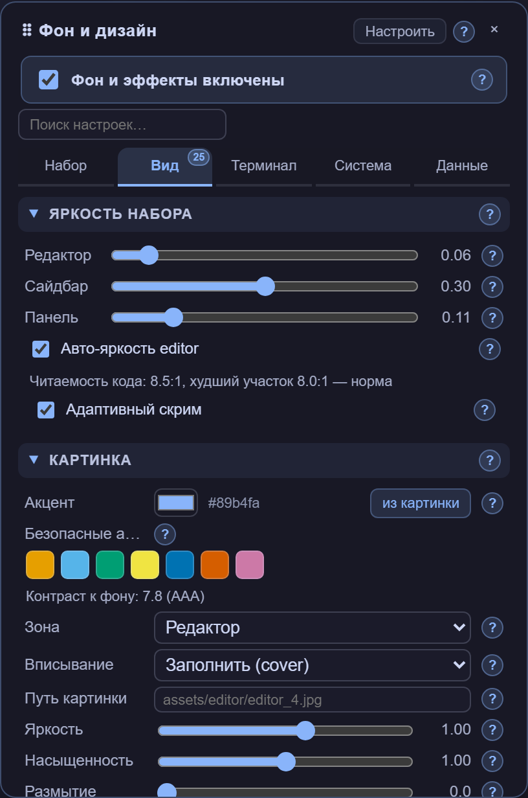</td>
    <td align="center">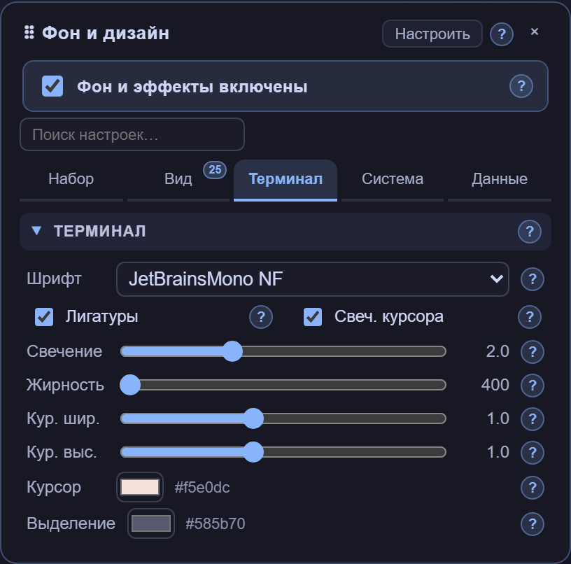</td>
    <td align="center">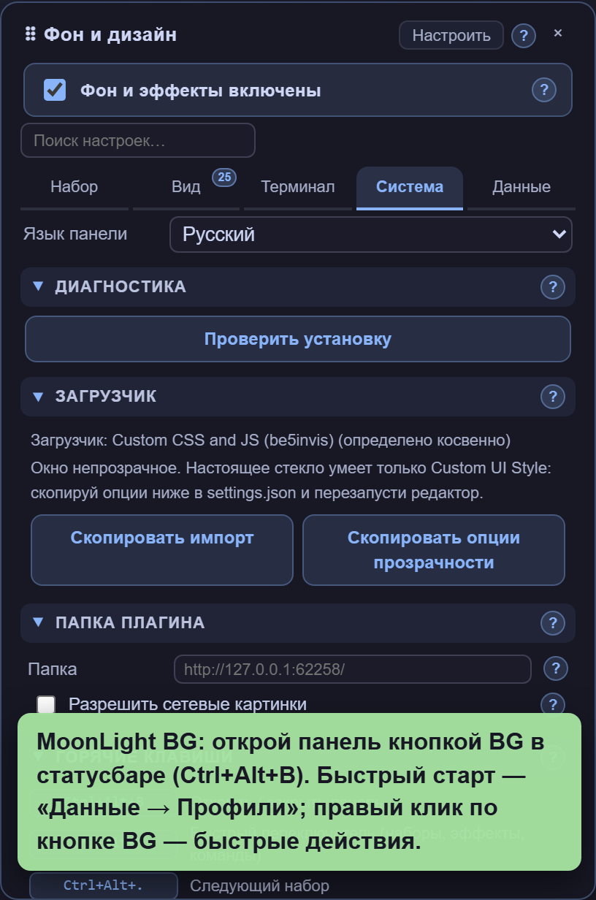</td>
    <td align="center">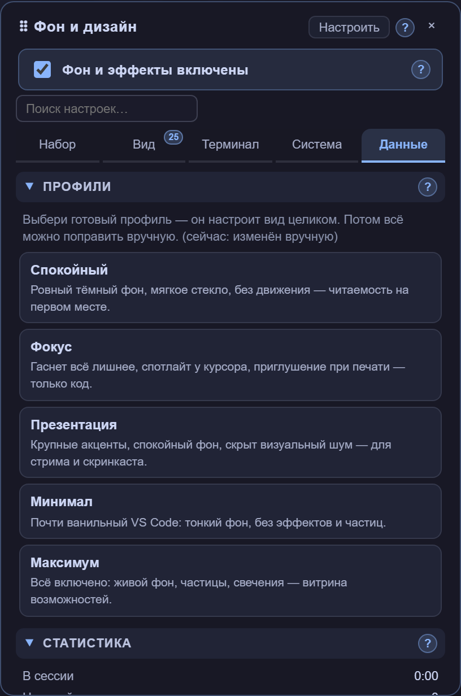</td>
  </tr>
  <tr valign="top">
    <td align="center">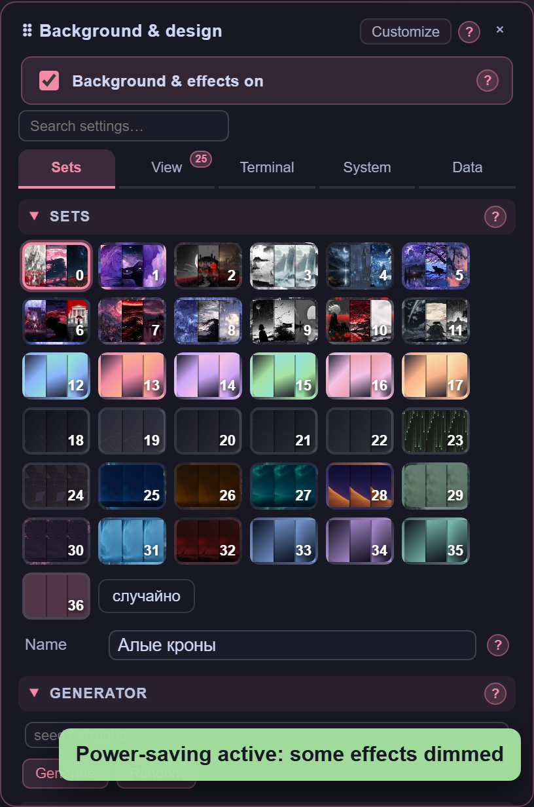</td>
    <td align="center">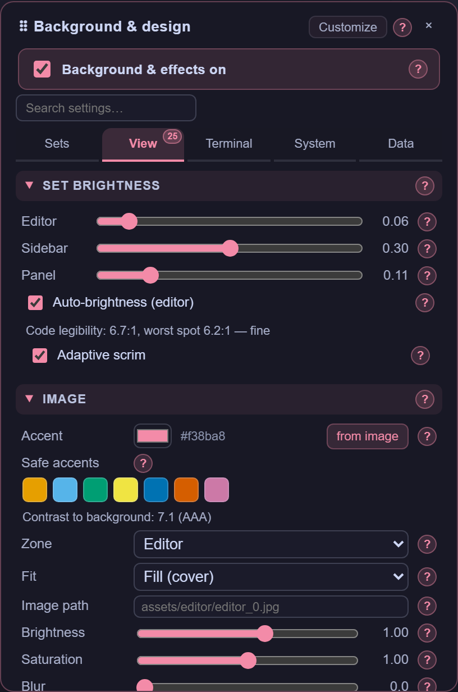</td>
    <td align="center">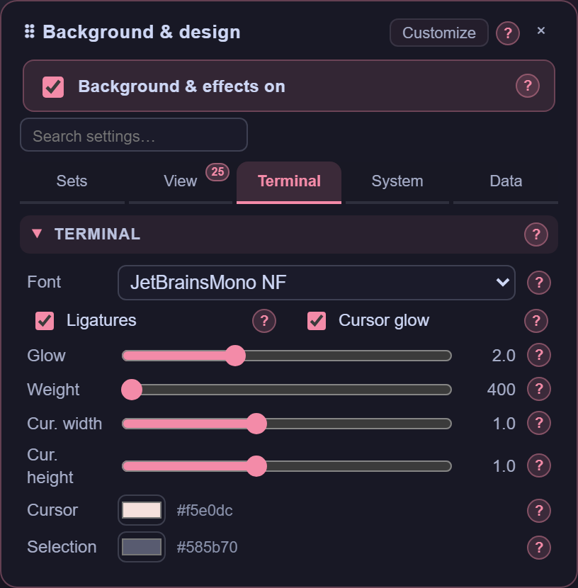</td>
    <td align="center">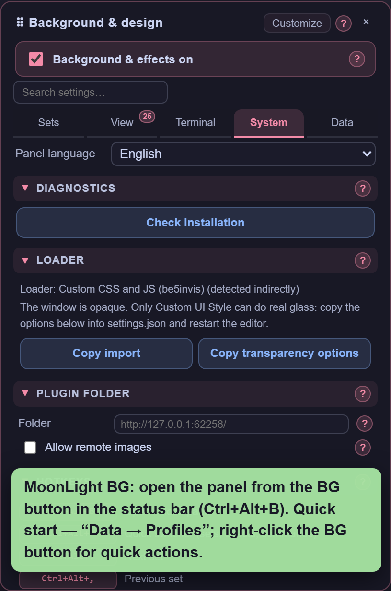</td>
    <td align="center">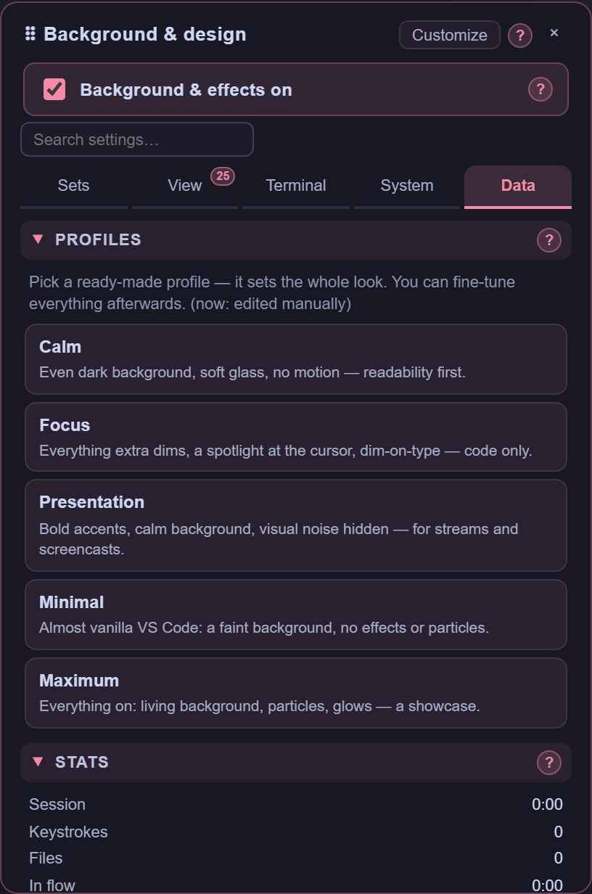</td>
  </tr>
</table>

<sub>Панель «Фон и дизайн» по всем пяти вкладкам. Верхний ряд — <b>русский</b> интерфейс (набор
«Хрустальное озеро», голубой акцент), нижний — <b>English</b> (набор «Алые кроны», розовый акцент):
язык переключается в «Система → Язык панели», а выбор набора перекрашивает и саму панель.</sub>

Панель можно перетаскивать за заголовок; позиция запоминается. Закрыть — `Esc` или клик мимо.
Открыть панель с клавиатуры — `Ctrl+Alt+B`. Внутри панели работает `Tab` (фокус не выходит за
пределы окна), закрытие возвращает фокус на кнопку `BG`.

Когда включён авто-режим, перед подписью кнопки `BG` появляется точка-индикатор: **кольцо** —
авто-набор по времени суток, **залитая точка** — слайдшоу.

### Горячие клавиши

| Клавиши | Действие |
|---|---|
| `Ctrl+Alt+B` | Открыть / закрыть панель «Фон и дизайн» |
| `Ctrl+Alt+.` | Следующий набор |
| `Ctrl+Alt+,` | Предыдущий набор |
| `Ctrl+Alt+0` | Включить / выключить фон и эффекты (мастер-выключатель) |
| `Ctrl+Alt+R` | Режим чтения (фон редактора почти гаснет ради читаемости кода) |

Переключение набора работает по кругу и показывает короткое уведомление с именем набора.
Сочетания завязаны на физические клавиши (`e.code`), поэтому не зависят от раскладки (RU/EN).

---

## Фон под проект и индикатор ветки

Две «контекстные» фичи в секции **«По проекту»**. Обе читают заголовок окна и статусбар VS Code —
API для этого в custom-css нет, поэтому парсится DOM. Это надёжно работает при стандартных
настройках, но может сбоить после крупных обновлений VS Code или при нестандартном `window.title`.

- **Фон по проекту.** Включи тумблер и выбери набор — он **закрепится за текущей папкой**. Открой
  другой проект — выбери свой набор. Дальше каждый проект открывается со своим фоном. «Забыть
  закрепление» убирает привязку. Имеет приоритет над слайдшоу и временем суток.
- **Полоска-индикатор ветки.** Тонкая линия у верхнего края окна подсказывает git-ветку:
  `main`/`master` — красноватая (ты на основной ветке), остальные — зеленоватая. Если git-индикатора
  в статусбаре нет, полоска не появляется.

---

## FAQ / Решение проблем

**После обновления VS Code фон и кнопка `BG` пропали.**
Это ограничение самого механизма custom-css, не плагина: при каждом обновлении VS Code патч
слетает. Верни его — `Ctrl+Shift+P` → **Enable Custom CSS and JS** → полный перезапуск
(`File → Exit`). Настройки при этом не теряются.

**VS Code пишет, что установка «повреждена» (Your Code installation appears to be corrupt).**
Это баннер, который показывает be5invis.vscode-custom-css после патча ядра — не ошибка плагина.
Нажми «шестерёнку» на баннере → **Don't Show Again**.

**Перенёс папку плагина — фон исчез, на чипах наборов красный «!».**
Картинки ищутся по старому пути. Открой кнопку `BG` → секцию **«Папка плагина»** и укажи путь к
папке с `assets` (в формате `vscode-file://vscode-app/…` или `file:///…`). Править исходник и
пересобирать не нужно. Пустое поле = путь определяется автоматически.

**Кнопки `BG` нет в статусбаре.**
Убедись, что путь в `vscode_custom_css.imports` ведёт именно к `custom-bg.js`, custom-css
включён (**Enable Custom CSS and JS**) и VS Code перезапущен целиком (`File → Exit`, не просто
закрытие окна). Проверь консоль: `Help → Toggle Developer Tools` → Console → строка
`[MoonLight custom-bg] v19 …`. Если её нет — скрипт не подгрузился (проверь путь и слэши).

**Как узнать версию.**
`Help → Toggle Developer Tools` → Console → строка `[MoonLight custom-bg] v19 …`.

**Ничего не помогло / нашёл баг / есть идея.**
Открой [issue](https://github.com/moonlivedt-oss/custom_VScode/issues) (приложи версию из
консоли и ОС) или зайди в
[Discussions](https://github.com/moonlivedt-oss/custom_VScode/discussions).

---

## Структура проекта

<details>
<summary><b>Развернуть дерево файлов и назначение модулей</b></summary>

```
vscode-bg/
  custom-bg.js         ← СОБРАННЫЙ файл (его грузит VS Code). НЕ редактировать вручную.
  build.js             ← сборщик: node build.js
  install.js           ← установщик: прописывает путь в settings.json (npm run setup)
  install.ps1 / .sh    ← тонкие обёртки над install.js (Windows / *nix)
  extension/           ← заготовка VS Code-расширения авто-настройки (упаковка за автором)
  package.json         ← npm-скрипты (build / test / check / setup / hooks); зависимостей нет
  README.md            ← этот файл
  CHANGELOG.md         ← история версий
  LICENSE              ← MIT
  .gitattributes       ← фиксирует перевод строк (LF) для текста
  .github/workflows/   ← CI: смоук-тест + проверка что custom-bg.js пересобран
  .github/ISSUE_TEMPLATE/ ← шаблоны issue (баг / идея) + ссылки на Discussions
  hooks/pre-commit     ← локальный git-хук: пересборка + smoke перед коммитом (npm run hooks)
  assets/              ← картинки
    editor/            ← фоны редактора набора (editor_0.jpg …)
    sidebar/           ← фоны сайдбара набора (sidebar_0.jpg …)
    panel/             ← фоны панели набора (panel_0.jpg …)
  src/
    core/
      config.js        ← IMG/imgBase, SETS (фото + градиентные + процедурные), DEFAULTS,
                          санитизация (mergeCfg + isColor/clampNum/safeFont/safeColor/safeBase),
                          санитайзер наборов (sanitizeSets — защита от битой ручной правки),
                          безопасность источников картинок (isRemoteUrl/imgAllowed), cfg
      state.js         ← активный набор, яркость, акцент, фон по проекту (workspaceName/
                          workspaceIndex/activeIndex), разрешение путей картинок
      scrape.js        ← централизованный DOM-скрейпинг (git-ветка/ошибки/имя проекта) +
                          учёт «здоровья» селекторов (scrapeHealth — для диагностики)
      i18n.js          ← локализация UI: t() + словарь EN (RU — исходный язык и ключ)
    fx/
      css.js           ← buildCSS (все стили) + градиенты (gradFor), палитра из картинки
                          (dominantAccent/dominantPalette/accentTrio) + ensureStyle/apply
    ui/
      dom.js           ← базовые DOM-хелперы (el / keyActivate)
      info.js          ← тексты подсказок INFO (RU) + INFO_EN + попап «?» (стекло, стрелка, анимация)
      controls.js      ← построители контролов панели (чипы, слайдеры, тумблеры, секции)
      io.js            ← экспорт / импорт / резерв / шаринг кодом + тосты
      statusbar.js     ← кнопка «BG N» в статусбаре
      panel.js         ← сборка панели «Фон и дизайн» + перетаскивание
    widgets/
      extras.js        ← часы, помидор, частицы, слайдшоу, авто-набор по времени
    boot.js            ← старт, самолечение (1-секундный тикер + MutationObserver), наблюдатель
                          темы, параллакс/поток/индикатор ветки, горячие клавиши
  test/
    smoke.js           ← смоук-тест (в vm-песочнице): node test/smoke.js
    e2e.spec.js        ← интеграционный тест (Playwright, живой DOM): npm run test:e2e
    fixture.html       ← скелет воркбенча VS Code для e2e
  playwright.config.js ← конфиг Playwright (dev-зависимость; в основной поток не входит)
  scripts/
    screenshots.js     ← генератор скринов панели для README (npm run screenshots)
  docs/
    screenshots/       ← картинки для README (hero + панель по вкладкам RU/EN)
```

> `custom-bg.min.js` (`npm run build:min`, безопасный стриппер, −44%) и артефакты Playwright
> в репозиторий не коммитятся (см. `.gitignore`). `extension/` содержит десктопную точку входа
> (`extension.js`: авто-настройка, health-check, синхронизация settings.json) и веб-точку
> (`extension-web.js`: темы MoonLight в vscode.dev / Codespaces).

</details>

---

## Сборка

Модули **не** используют `import`/`export` — они живут в одной области видимости (как раньше в
монолите). `build.js` склеивает их по порядку из списка `FILES` внутрь одного IIFE. Порядок важен:
сначала данные / состояние, потом CSS, UI, виджеты, старт. Смоук-тест берёт этот же список
`FILES` из `build.js` (единый источник правды), чтобы собирать модули в том же порядке.

```bash
node build.js        # → пересобирает custom-bg.js   (или: npm run build)
node test/smoke.js   # → смоук-тест                    (или: npm test)
npm run check        # → сборка + смоук-тест одной командой
npm run build:min    # → минифицированный custom-bg.min.js (безопасный стриппер, −44%)
npm run hooks        # → поставить локальный pre-commit хук (git config core.hooksPath hooks)
```

<details>
<summary>Playwright: интеграционный тест и генерация скриншотов (dev-зависимость)</summary>

```bash
npm i -D @playwright/test && npx playwright install chromium   # разово
npm run test:e2e     # → живой Chromium открывает панель и проверяет кнопку/инжект/локализацию
npm run screenshots  # → пересоздаёт docs/screenshots/menu-<lang>-<tab>.png (RU/EN × 5 вкладок)
```

Playwright в основной ноль-зависимостей поток не входит — нужен только для e2e и скриншотов.

</details>

> Зависимостей нет, `npm install` не требуется — скрипты просто зовут `node`. При каждом
> `push` / `pull request` в `main` GitHub Actions прогоняет смоук-тест и проверяет, что
> `custom-bg.js` пересобран из `src/` (иначе PR не пройдёт CI). Тот же контроль локально даёт
> `npm run hooks` — pre-commit пересобирает артефакт, гоняет smoke и не даёт закоммитить рассинхрон.

Смоук-тест собирает модули, выполняет их в мини-DOM-стабе и проверяет генерацию CSS (акцент
набора, вписывание, url, прозрачность, авто-дим, 404-фолбэк, светлая/тёмная тема, градиентные
наборы, палитру из картинки, параллакс/поток, фон по проекту, шаринг и блокировку сетевых
картинок). Это ловит кросс-модульные `ReferenceError`, которые `node --check` не видит. Прогоняй
его после каждой правки в `src/**`.

**Цикл правки:**

1. Правишь файл в `src/**`.
2. `node build.js`.
3. VS Code: `Ctrl+Shift+P` → **Enable Custom CSS and JS**.
4. Полный перезапуск VS Code (`File → Exit`).

---

## Добавление набора

Картинки лежат в `assets/`: фоны набора — в подпапках `editor/`, `sidebar/`, `panel/`.
Поддерживаются png / jpg / gif.

**Фото-набор:**

1. Положи 3 картинки в `assets/editor/`, `assets/sidebar/`, `assets/panel/`
   (например `editor_12.jpg`, `sidebar_12.jpg`, `panel_12.jpg`).
2. Добавь запись в массив `SETS` в `src/core/config.js`:
   ```js
   { name: "Мой набор",
     editor: "assets/editor/editor_12.jpg",
     sidebar: "assets/sidebar/sidebar_12.jpg",
     panel:   "assets/panel/panel_12.jpg",
     accent:  "#f5c2e7" }   // свой акцентный цвет набора
   ```
3. `node build.js` → в VS Code `Enable Custom CSS and JS` → полный перезапуск.

**Генеративный набор** (без картинок) — вместо путей задаётся палитра:

```js
{ name: "Мой градиент", grad: ["#1e1e2e", "#89b4fa", "#94e2d5"], accent: "#89b4fa" }
```

Пути в `SETS` указываются относительно базы картинок (`imgBase()`: путь из панели «Папка плагина»
или авто-определённый `IMG`). Health-check в панели пометит чип красным «!», если картинка не грузится.

---

## Безопасность

Весь внешний конфиг (из `localStorage`, при **импорте** JSON-файла, из пресетов и **кода образа**)
проходит через `mergeCfg` в `src/core/config.js`, который принимает только значения известного типа
и диапазона:

- **шрифт терминала** — только из белого списка `TERM_FONTS` (`safeFont`);
- **цвета** — строго `#rrggbb` (`isColor`, регэксп);
- **числа** — зажимаются в допустимые диапазоны (`clampNum`);
- **флаги** — только `boolean`; `mode` — `"random"` или индекс набора в диапазоне;
- **индексы по наборам** (`setOp` / `setAccent` / `setImg` / авто-набор / фон по проекту) — только
  существующие наборы (`< SETS.length`); число ключей `ui.collapsed` и `workspaceSets` ограничено.

Дополнительно (defense-in-depth):

- **сетевые картинки заблокированы по умолчанию** — картинка из конфига уходит в CSS `url()` и в
  `new Image().src`, поэтому импортированный или чужой конфиг **не может** заставить редактор пойти
  в сеть за картинкой (утечка IP, факт использования плагина, трекер-маячок). Пропускаются только
  по-настоящему локальные пути: относительные, `vscode-file:`, `data:` и `file:///` с **пустым
  хостом** (или `localhost`). Блокируются `http(s)://`, `//host` **и `file://ХОСТ/…`** — последнее
  на Windows разворачивается в UNC-путь `\\ХОСТ\…`, то есть сетевой SMB-запрос с утечкой
  NetNTLM-хеша (класс атаки `CVE-2025-24054`); вариант с обратными слэшами тоже ловится. Всё это
  проходит, только когда пользователь сам включил **«Разрешить сетевые картинки»**;
- **импорт и пресеты не включают сеть сами** — чужой JSON-файл или пресет принимаются с
  принудительно **выключенными** сетевыми картинками (`mergeForeign`): даже если в файле стоял
  `allowRemoteImages: true`, он сбрасывается, а панель **предупреждает** о числе заблокированных
  ссылок. Включить сеть можно только вручную тумблером. Собственный сохранённый конфиг своё
  согласие сохраняет;
- **prototype pollution** — JSON разбирается через `safeParse` (reviver отбрасывает ключи
  `__proto__` / `constructor` / `prototype`); те же ключи отсекаются и в именах проектов;
- **CSS-инъекция** — пути картинок экранируются (`cssUrl`), шрифт/цвета `buildCSS` санитизирует
  **повторно** перед вставкой в CSS; стиль пишется через `textContent` (не `innerHTML`), так что
  HTML-инъекция невозможна;
- **резерв конфига** — перед импортом / сбросом / применением пресета текущий вид уходит в
  отдельный ключ, кнопка «Восстановить прежние настройки» откатывает неудачную замену;
- **устойчивость к ручной правке** — если хочется «покопаться» в исходнике, одна опечатка не
  сломает редактор: массив `SETS` прогоняется через `sanitizeSets` (битые записи чинятся или
  отбрасываются, пустой список заменяется одним безопасным набором), а если сборка CSS всё же
  упала — `ensureStyle` включает **безопасный режим** (видна кнопка `BG`, панель открывается,
  там есть «Сбросить к дефолту» и «Диагностика») и один раз пишет причину в консоль;
- **размер** — импорт и хранилище отсекаются по размеру (>256 КБ).

Код образа (**«Поделиться»**) кодирует только внешний вид — без картинок, путей и привязок к
проектам; при применении чужого кода машинно-зависимое (свои картинки, путь плагина, закрепления)
не затрагивается.

---

## Лицензия

MIT — см. [LICENSE](LICENSE). Наборы фонов и палитры — часть проекта; используй, меняй и делись.

---

<div align="center">
  <sub><b>MoonLight custom-bg</b> — один скрипт, ноль зависимостей, весь вид в твоих руках.</sub>
  <br>
  <sub>Нашёл баг или есть идея? — <a href="https://github.com/moonlivedt-oss/custom_VScode/issues">Issues</a> · <a href="https://github.com/moonlivedt-oss/custom_VScode/discussions">Discussions</a></sub>
</div>
